# 电机控制系统仿真实验报告

<center><div style='height:2mm;'></div><div style="font-family:华文楷体;font-size:14pt;">姓名 卢裕锐  </div></center>
<center><span style="font-family:华文楷体;font-size:12pt">哈尔滨工程大学创梦之翼战队，电控组，邮箱 tianle4@outlook.com<br /></span>


## 八字方针：建模 分析 设计 校验

### 一、建模

#### 1.1 确定传递函数形式

#### 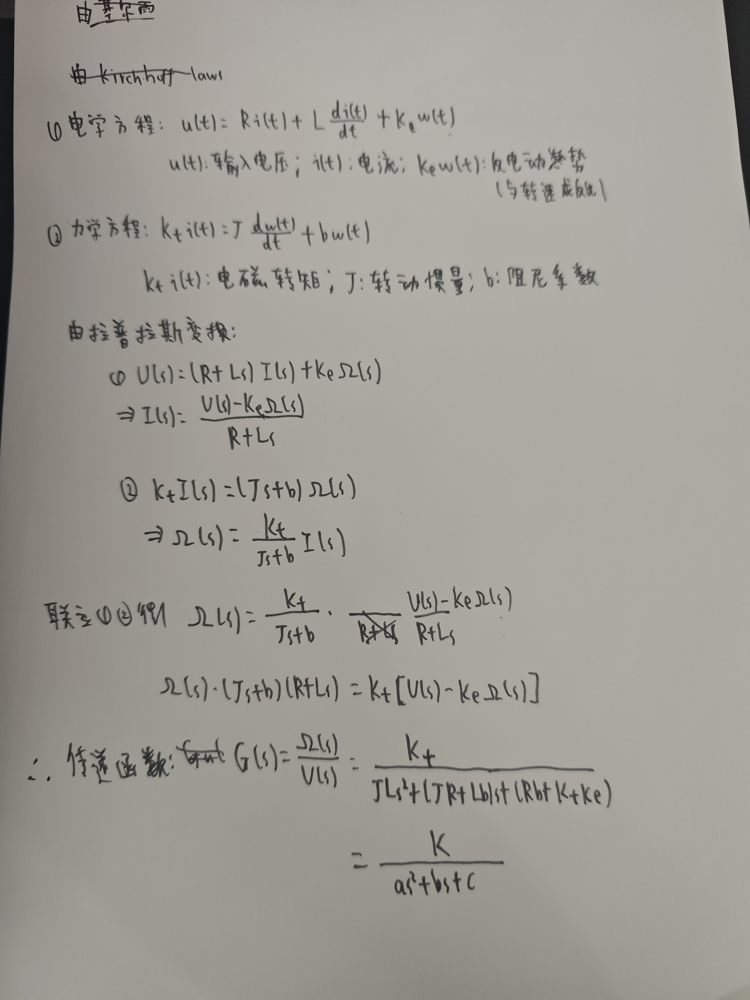

#### <font color=Green>1.2 确定传递函数参数</font>

### 二、分析

#### <font color=Green>2.1 系统开环传递函数根轨迹</font>

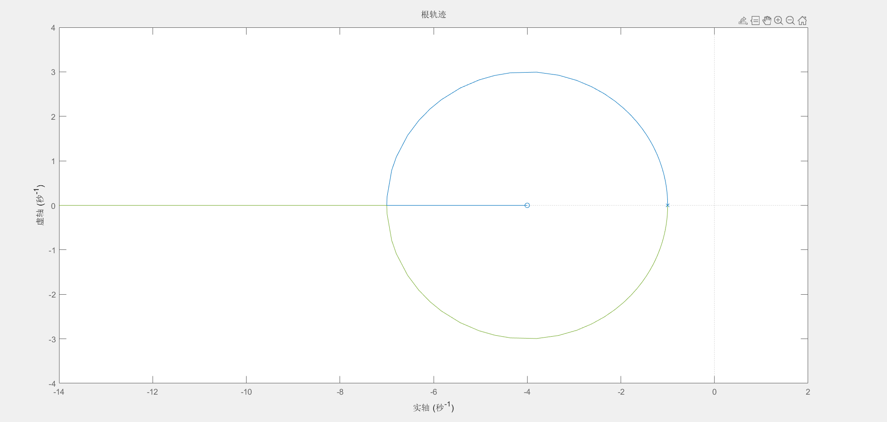

传递函数为：G(s) = $\frac{s + 4}{s^2 + 2s + 1} $ ；开环极点为：s = -1，-1（双重极点）；开环零点为：s = -4

根轨迹从两个开环极点 (−1,0)(−1,0) 开始。随着增益K的增加，一个极点逐渐向左移动，最终到达开环零点 (−4,0)(−4,0)；另一个极点则沿着实轴向负无穷远移动。在所有K>0的情况下，系统始终稳定，闭环极点始终位于复平面的左半平面

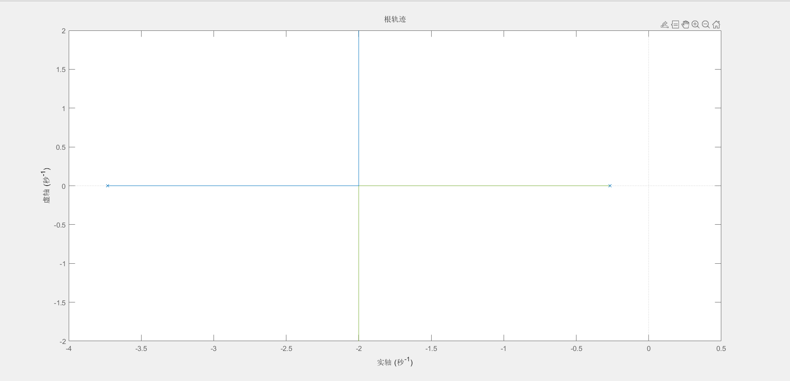

传递函数为：$\frac{1}{s^2 + 4s + 1}$ 开环极点为：S~1~ = -2 + $\sqrt{3}$，S~2~ = -2 - $\sqrt{3}$ ；无开环零点

根轨迹从两个开环极点出发，沿着虚轴对称展开，两条轨迹分支分别朝复平面的正虚轴和负虚轴延伸，轨迹对称。由于系统没有开环零点，因此根轨迹的分支会趋向于无穷远。

#### <font color=Green>2.2 系统开环传递函数伯德图</font>

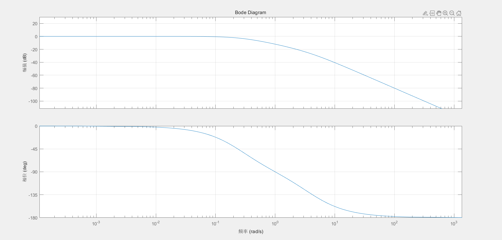

传递函数为：$\frac{1}{s^2 + 4s + 1}$ 


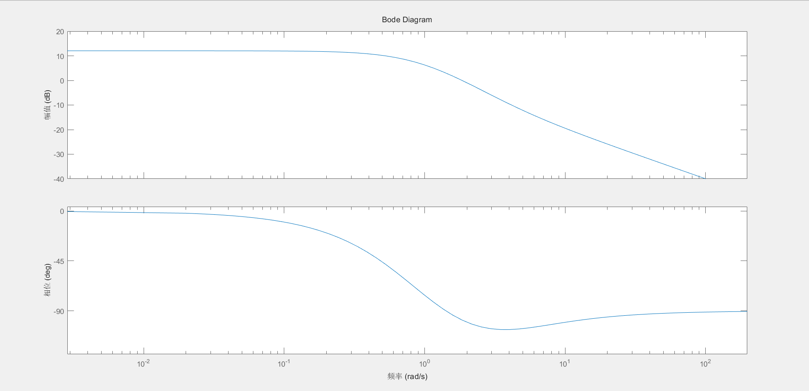

传递函数为：$\frac{s + 4}{s^2 + 2s + 1}$ 


### 三、设计

#### 3.1 PID控制器的数学表达式

C(s) = K+ $\frac{Ki}{s}$ + K~d~s

#### 3.2 控制器C语言代码

```c
void PID_Init(pid_t *pid, float Kp, float Ki, float Kd)//pid初始化
{
    pid->err = 0;
    pid->err_sum = 0;
    pid->err_difference = 0;
    pid->last_err = 0;
    pid->Kp = Kp;
    pid->Ki = Ki;
    pid->Kd = Kd;
    pid->output_filter = 0;
    pid->alpha = 0.1f;  // 滤波系数
}

float PID_Calculate(pid_t *pid, float target, float current)
{
    pid->err = target - current;
    pid->err_sum += pid->err;
    pid->err_difference = pid->err - pid->last_err;
    pid->last_err = pid->err;
    
    if(pid->err_sum > 1000) pid->err_sum = 1000;
    if(pid->err_sum < -1000) pid->err_sum = -1000;
    
    float output = (pid->Kp * pid->err) + (pid->Ki * pid->err_sum) + (pid->Kd * pid->err_difference);
    
    pid->output_filter = pid->alpha * output + (1 - pid->alpha) * pid->output_filter;//低通滤波
    
    return pid->output_filter;
}
```

#### <font color=Green>3.3 加入控制器后的simulink仿真结构图</font>

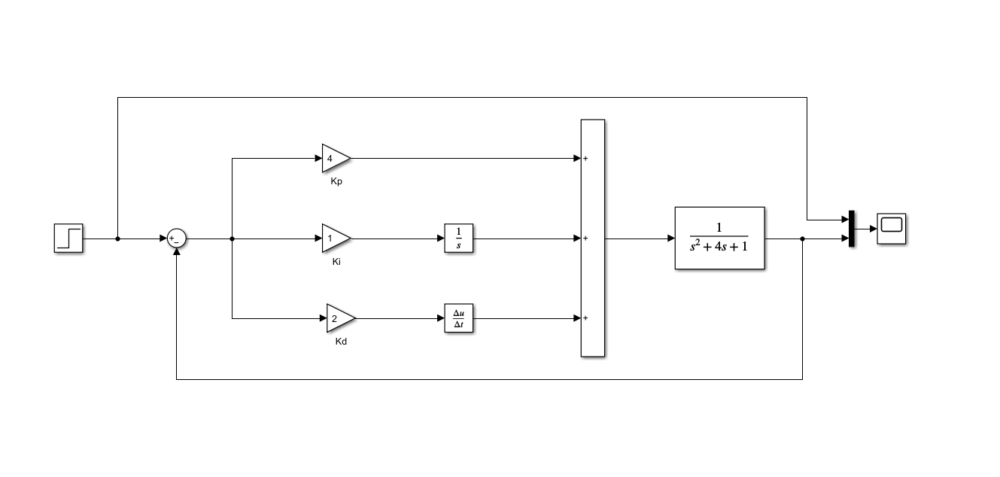

Kp为比例项，Ki为积分项，Kd为微分项

#### <font color=Green>3.4 simulink仿真结果</font>

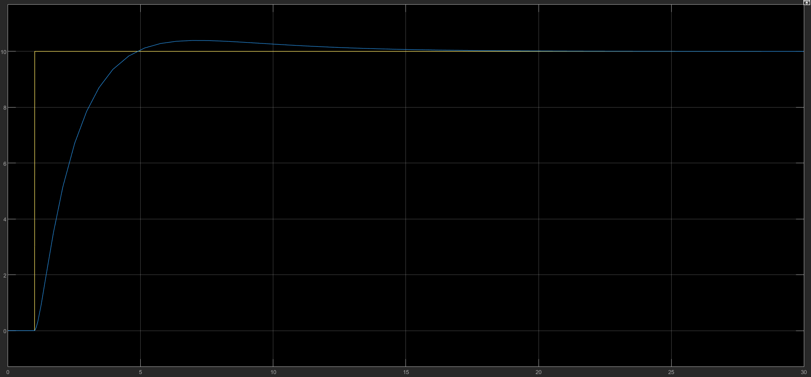

输出信号从 0 开始逐步上升，说明系统在**响应时间**内逐渐接近目标值，在这一阶段，比例控制器 Kp 主导作用，快速缩小误差信号。

输出信号在4 > 5s 时出现超调，并在 t=6s 后，在微分控制器的作用下，输出信号开始逐渐减小，趋近于目标值 10。

### 四、校验（最重要）

#### 4.1 速度闭环

##### （1）系统框图

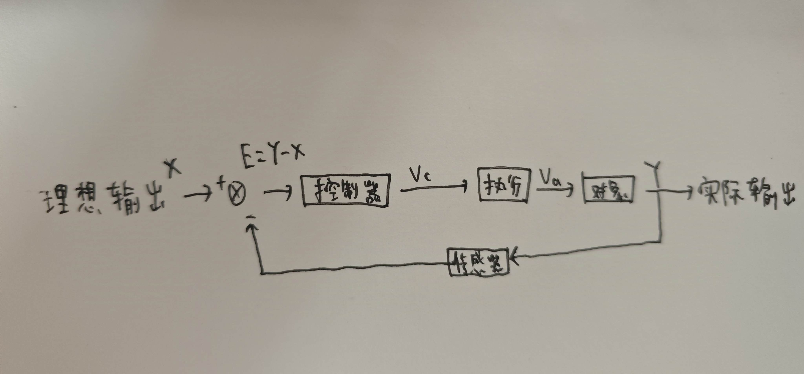

##### （2）关键代码

```c
void PID_Init(pid_t *pid, float Kp, float Ki, float Kd)//pid初始化
{
    pid->err = 0;
    pid->err_sum = 0;
    pid->err_difference = 0;
    pid->last_err = 0;
    pid->Kp = Kp;
    pid->Ki = Ki;
    pid->Kd = Kd;
    pid->output_filter = 0;
    pid->alpha = 0.1f;  // 滤波系数
}

	Input = PID_Calculate(&pid_velocity, current_reference, Motor.Velocity);
    Motor_Simulation(&Motor, Input, dt);
  	Motor.Velocity = Get_Motor_Velocity(&Motor);

float PID_Calculate(pid_t *pid, float target, float current)
{
    pid->err = target - current;
    pid->err_sum += pid->err;
    pid->err_difference = pid->err - pid->last_err;
    pid->last_err = pid->err;
    
    if(pid->err_sum > 1000) pid->err_sum = 1000;
    if(pid->err_sum < -1000) pid->err_sum = -1000;
    
    float output = (pid->Kp * pid->err) + (pid->Ki * pid->err_sum) + (pid->Kd * pid->err_difference);
    
    pid->output_filter = pid->alpha * output + (1 - pid->alpha) * pid->output_filter;//低通滤波
    
    return pid->output_filter;
}
```

##### （3）阶跃响应时域图


0 - 500ms上升速度较慢，上升时间长，动态响应慢。达到500ms后存在超调，随后趋于稳定，稳态误差为零

##### （4） 斜坡响应时域图

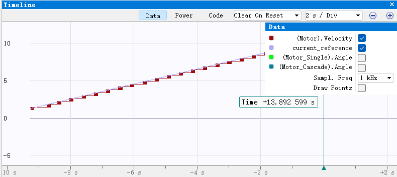

图像表明，系统输出表现为平滑曲线，无明显震荡或过冲，能够较好地跟踪输入信号较为稳定；但存在一定的瞬态误差和时间延迟。

##### （5）频率响应时域图


系统对输入信号的响应存在一定的时间滞后，并且输入信号的幅值有所衰减。不过，系统能够较好地跟踪输入信号

同时，由于低通滤波的影响，幅值减少较为明显。

#### 4.2 角度闭环

##### （1）系统框图

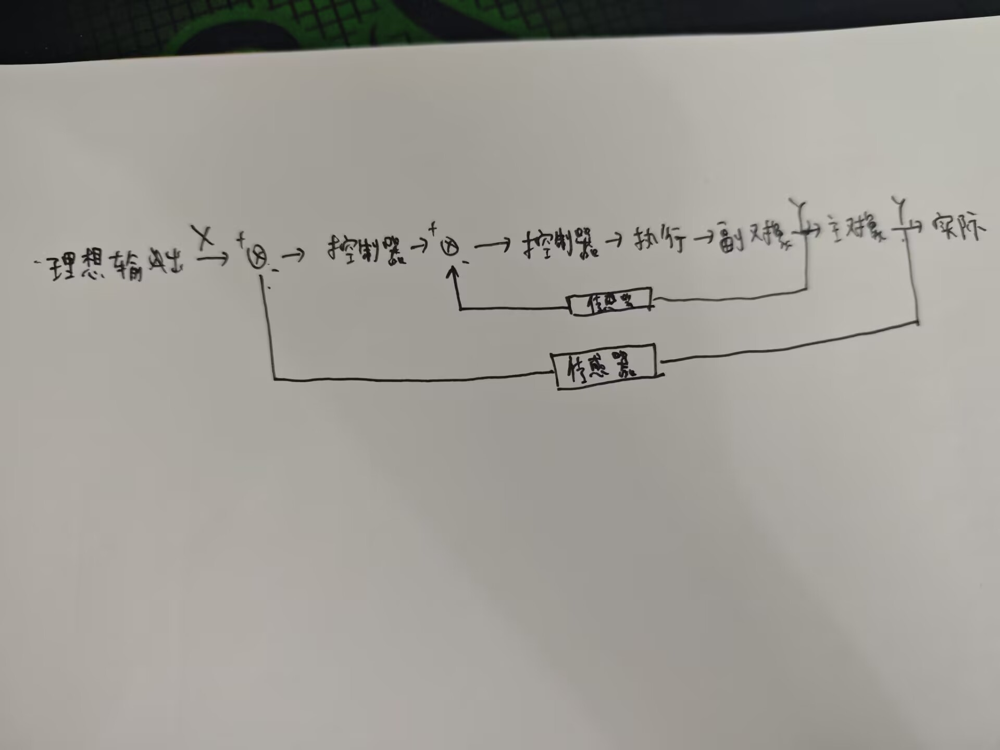

##### （2）关键代码

```c
single_output = PID_Calculate(&pid_angle, current_reference, Motor_Single.Angle);//单
Motor_Simulation(&Motor_Single, single_output, dt);
Motor_Single.Angle = Get_Motor_Angle(&Motor_Single);

cascade_outer_output = PID_Calculate(&pid_angle, current_reference,Motor_Cascade.Angle);//串
cascade_inner_output = PID_Calculate(&pid_angle2, cascade_outer_output, Motor_Cascade.Velocity);
Motor_Simulation(&Motor_Cascade, cascade_inner_output, dt);
Motor_Cascade.Angle = Get_Motor_Angle(&Motor_Cascade);

float PID_Calculate(pid_t *pid, float target, float current)//pid运算
{
    pid->err = target - current;
    pid->err_sum += pid->err;
    pid->err_difference = (pid->err - pid->last_err);
    pid->last_err = pid->err;

    if(pid->err_sum > 1000) pid->err_sum = 1000;
    if(pid->err_sum < -1000) pid->err_sum = -1000;
    
    float output = (pid->Kp * pid->err) + 
                   (pid->Ki * pid->err_sum) + 
                   (pid->Kd * pid->err_difference);
    
    pid->output_lvbo = pid->lvbo * output + (1 - pid->lvbo) * pid->output_lvbo;
    
    return pid->output_lvbo;//滤波输出
}
```

##### （3）阶跃响应时域图

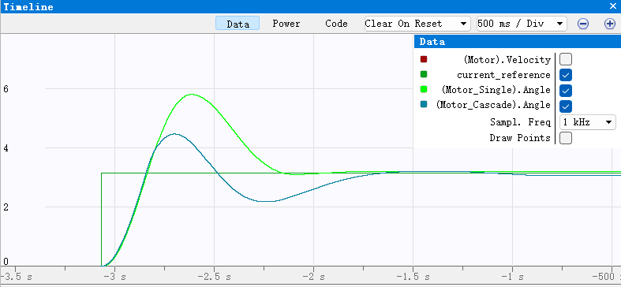

图中：蓝线为串级pid，绿线为单极pid

单级pid的响应更为快速，但超调也更为明显，相对串级pid来说不太稳定。而串级pid响应速度较慢，但相对稳定，振荡较小。

##### （4）频率响应时域图

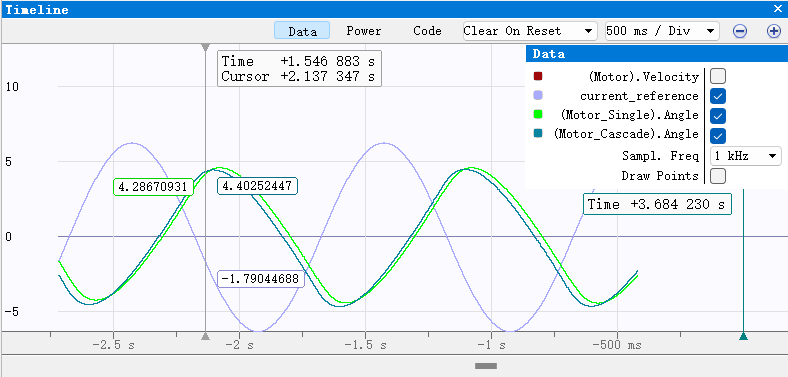

图中：淡蓝线为理想曲线，绿线为单级，蓝线为串级

单级pid响应曲线的幅值响应较大，波动明显，同时滞后较大，动态响应差；而串级pid响应曲线相对稳定，滞后也更小，动态响应好

##### （5）抗干扰性能时域图

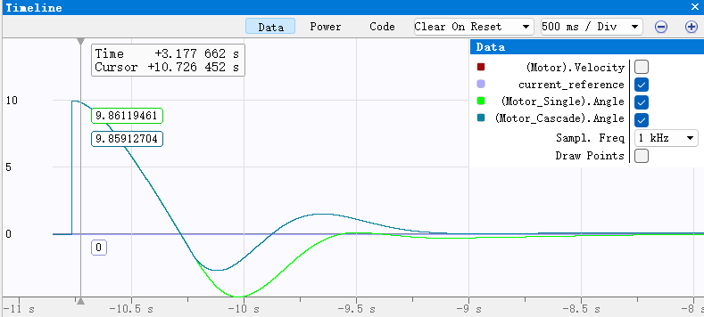

图中：淡蓝线为理想曲线，绿线为单级，蓝线为串级

单级pid调节时间较长，系统在多次振荡后才逐渐趋于稳定，而串级pid具有更快的响应能力，振荡幅度较小。相较来说，串级pid的

抗干扰能力更强。

### 五、扩展内容

### <font color=Green>1、推导该电机系统的传递函数</font>


### <font color=Green>2、复合控制</font>


#### <font color=Green>2.1 控制器设计</font>


#### <font color=Green>2.2 关键代码</font>

```
//此处粘贴代码
```

#### <font color=Green>2.3 效果展示</font>

（1）角度闭环阶跃响应


（2）角度闭环频率响应


（3）角度闭环抗干扰性能


### <font color=Green>3、滤波</font>
