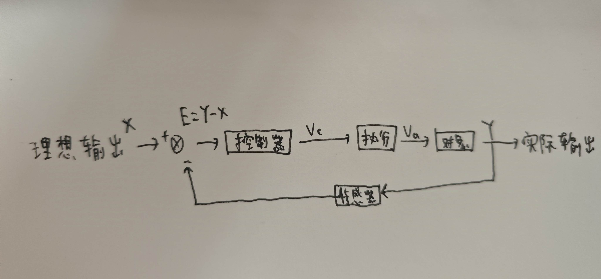
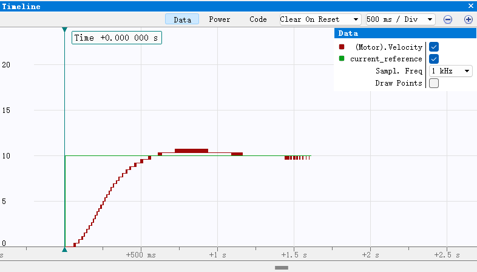
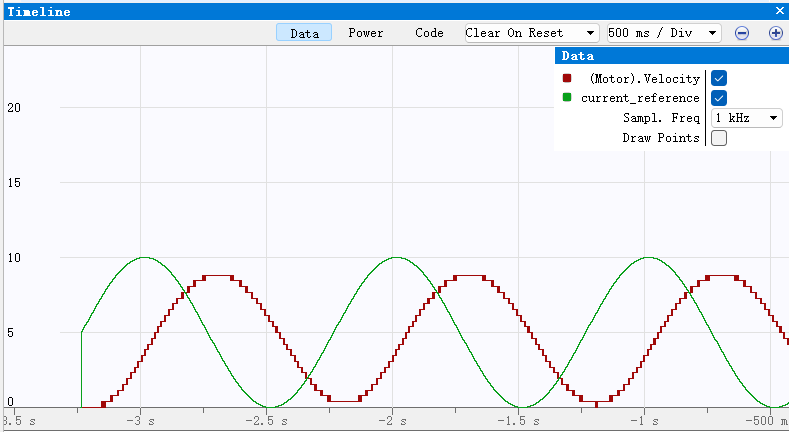

# 电机控制系统仿真实验报告

<center><div style='height:2mm;'></div><div style="font-family:华文楷体;font-size:14pt;">姓名 卢裕锐  </div></center>
<center><span style="font-family:华文楷体;font-size:12pt">哈尔滨工程大学创梦之翼战队，电控组，邮箱 tianle4@outlook.com<br /></span>


<font color=Blue>注意事项 ：</font>

<font color=Blue>1、应将所有蓝色字体删去作为最终上交的报告。</font>

<font color=Blue>2、可以参考优秀文章和相关资料，但是不能照抄</font>。

<font color=Blue>3、绿色字体标题内容为选做部分，其余为必做部分。</font>

<font color=Blue>4、注意：寒假第一次作业质量不合格者，将失去梯队队员资格！！！</font>

## 八字方针：建模 分析 设计 校验

### 一、建模

#### 1.1 确定传递函数形式

<font color=Blue>运用机理法，通过分析系统的数学物理关系，建立系统的数学模型，如微分方程，传递函数等。实验说明文档中已经给出了示例，可以参考文档，并添加自己的理解。把建模的过程写在这里。</font>

#### <font color=Green>1.2 确定传递函数参数</font>

<font color=Blue>运用实验法，向系统添加已知的输入，通过研究其响应确定传递函数参数。在这里填入传递函数参数，具体推导方法写在第五节。</font>

### 二、分析

<font color=Blue>利用根轨迹，伯德图等方法，分析开环系统的性能，如响应速度，超调大小，稳定性，稳态误差等。</font>

#### <font color=Green>2.1 系统开环传递函数根轨迹</font>

<font color=Blue>放一系列开环系统根轨迹的图片并做一定分析</font>

#### <font color=Green>2.2 系统开环传递函数伯德图</font>

<font color=Blue>放一系列开环系统伯德图并做一定分析</font>

### 三、设计

<font color=Blue>设计控制器，并调节参数，提高系统的控制性能，如加快响应速度，抑制超调，消除稳态误差等。</font>

#### 3.1 PID控制器的数学表达式

<font color=Blue>控制器的微分方程，差分方程或传递函数。</font>

C(s) = K+ $\frac{Ki}{s}$ + K~d~s

#### 3.2 控制器C语言代码

```c
void PID_Init(pid_t *pid, float Kp, float Ki, float Kd)//pid初始化
{
    pid->err = 0;
    pid->err_sum = 0;
    pid->err_difference = 0;
    pid->last_err = 0;
    pid->Kp = Kp;
    pid->Ki = Ki;
    pid->Kd = Kd;
    pid->output_filter = 0;
    pid->alpha = 0.1f;  // 滤波系数
}

float PID_Calculate(pid_t *pid, float target, float current)
{
    pid->err = target - current;
    pid->err_sum += pid->err;
    pid->err_difference = pid->err - pid->last_err;
    pid->last_err = pid->err;
    
    if(pid->err_sum > 1000) pid->err_sum = 1000;
    if(pid->err_sum < -1000) pid->err_sum = -1000;
    
    float output = (pid->Kp * pid->err) + (pid->Ki * pid->err_sum) + (pid->Kd * pid->err_difference);
    
    pid->output_filter = pid->alpha * output + (1 - pid->alpha) * pid->output_filter;//低通滤波
    
    return pid->output_filter;
}
```

#### <font color=Green>3.3 加入控制器后的simulink仿真结构图</font>

<font color=Blue>在这里放一张simulink仿真结构图并做说明。</font>

#### <font color=Green>3.4 simulink仿真结果</font>

<font color=Blue>把simulink仿真结果放在这里并做说明。</font>

### 四、校验（最重要）

<font color=Blue>将设计的控制器编写成C语言，并在单片机中运行电机仿真程序，观察电机响应曲线。</font>

<font color=Blue>注：即使没有把传递函数建模出来，仍可通过凑试法来确定控制器参数。</font>

#### 4.1 速度闭环

##### （1）系统框图

<font color=Blue>绘制系统速度闭环控制框图</font>



##### （2）关键代码

```c
PID_Init(pid_t *pid, 0.1, 0.01, 0.02);

void PID_Init(pid_t *pid, float Kp, float Ki, float Kd)//pid初始化
{
    pid->err = 0;
    pid->err_sum = 0;
    pid->err_difference = 0;
    pid->last_err = 0;
    pid->Kp = Kp;
    pid->Ki = Ki;
    pid->Kd = Kd;
    pid->output_filter = 0;
    pid->alpha = 0.1f;  // 滤波系数
}

float PID_Calculate(pid_t *pid, float target, float current)
{
    pid->err = target - current;
    pid->err_sum += pid->err;
    pid->err_difference = pid->err - pid->last_err;
    pid->last_err = pid->err;
    
    if(pid->err_sum > 1000) pid->err_sum = 1000;
    if(pid->err_sum < -1000) pid->err_sum = -1000;
    
    float output = (pid->Kp * pid->err) + (pid->Ki * pid->err_sum) + (pid->Kd * pid->err_difference);
    
    pid->output_filter = pid->alpha * output + (1 - pid->alpha) * pid->output_filter;//低通滤波
    
    return pid->output_filter;
}
```

##### （3）阶跃响应时域图

<font color=Blue>放一张图，应至少包含期望速度与速度闭环控制系统实际速度两条曲线。并对比分析结果。</font>



0 - 500ms上升速度较慢，上升时间长，动态响应慢。达到500ms后存在超调，随后趋于稳定，稳态误差为零

##### （4） 斜坡响应时域图

<font color=Blue>放一张图，应至少包含期望速度与速度闭环控制系统实际速度两条曲线。并对比分析结果。</font>

##### （5）频率响应时域图

<font color=Blue>放一张图，应至少包含期望速度与速度闭环控制系统实际速度两条曲线。并对比分析结果。</font>



#### 4.2 角度闭环

##### （1）系统框图

<font color=Blue>绘制系统角度闭环控制框图</font>


##### （2）关键代码

```
//此处粘贴代码
```

##### （3）阶跃响应时域图

<font color=Blue>放一张图，应至少包含期望角度，单级PID实际角度，串级PID实际角度三条曲线。并对比分析结果。</font>


##### （4）频率响应时域图

<font color=Blue>放一张图，应至少包含期望角度与期望角度，单级PID实际角度，串级PID实际角度三条曲线。并对比分析结果。</font>

##### （5）抗干扰性能时域图

<font color=Blue>放一张图，应至少包含期望角度，单级PID实际角度，串级PID实际角度三条曲线。并于无干扰的控制情况对比分析结果。</font>


<font color=Blue>提示：建模时难免会有误差，因此控制器参数需要在校验时进行调整。</font>

### 五、扩展内容

### <font color=Green>1、推导该电机系统的传递函数</font>

<font color=Blue>描述建立传递函数的方法、自己的思路以及结果</font>

<font color=Blue>附上设计过程中重要的截图</font>

### <font color=Green>2、复合控制</font>

<font color=Blue>自行查阅资料，采用能想到的方法设计更好的控制器（PID优化，前馈等），从而提高系统的性能。</font>

#### <font color=Green>2.1 控制器设计</font>

<font color=Blue>在这里详细介绍自己选择的控制器。并贴上系统框图</font>

#### <font color=Green>2.2 关键代码</font>

```
//此处粘贴代码
```

#### <font color=Green>2.3 效果展示</font>

（1）角度闭环阶跃响应

<font color=Blue>放一张图，应至少包含期望角度，用传统PID闭环控制的实际曲线和用改进控制器的实际曲线三条曲线。并对比分析结果。</font>

（2）角度闭环频率响应

<font color=Blue>放一张图，应至少包含期望角度，用传统PID闭环控制的实际曲线和用改进控制器的实际曲线三条曲线。并对比分析结果。</font>

（3）角度闭环抗干扰性能

<font color=Blue>放一张图，应至少包含期望角度，用传统PID闭环控制的实际曲线和用改进控制器的实际曲线三条曲线。并对比分析结果。</font>

### <font color=Green>3、滤波</font>

<font color=Blue>在Matlab仿真中给系统的反馈信号叠加噪声，并自行设计滤波器滤除噪声，比较滤波前后的控制效果。</font>
